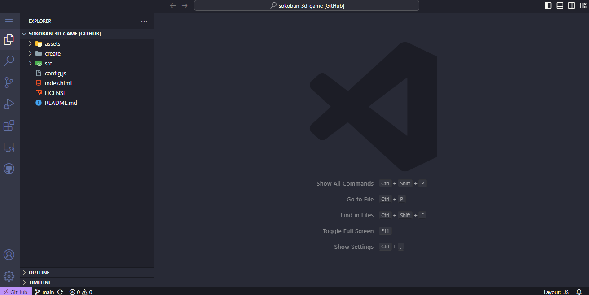
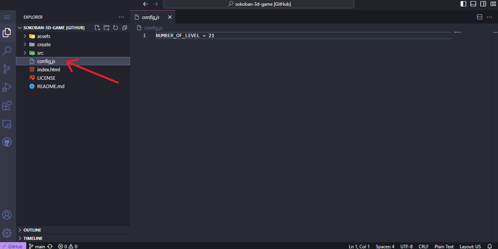
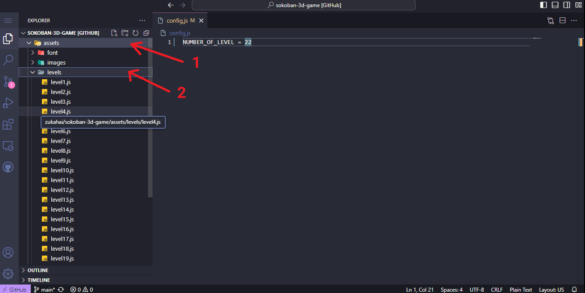
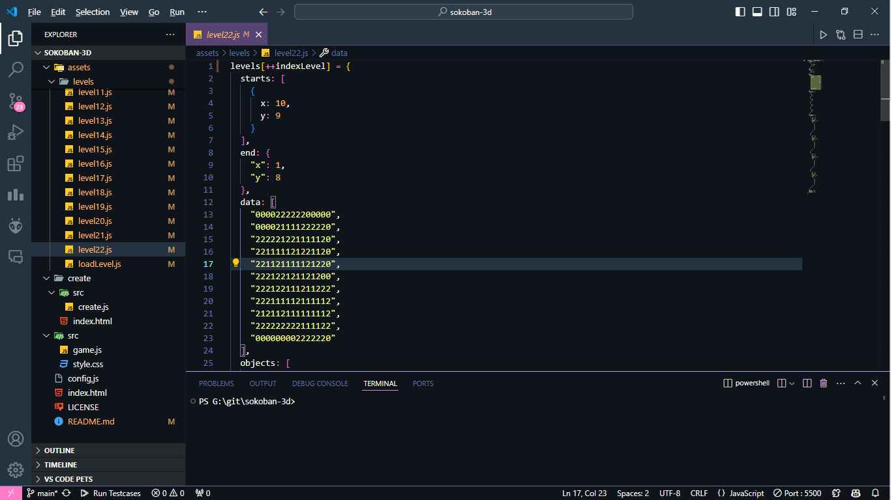
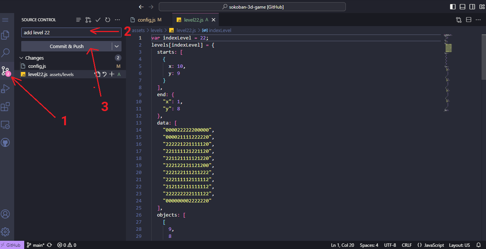
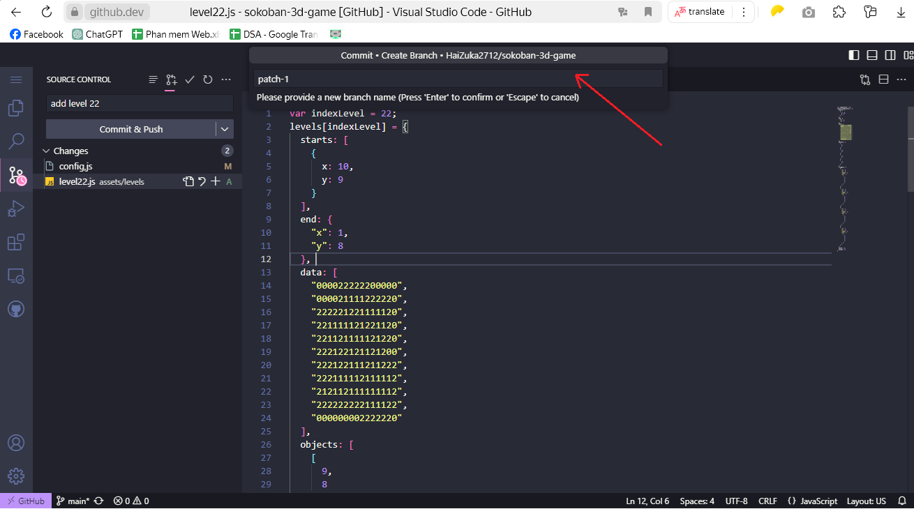
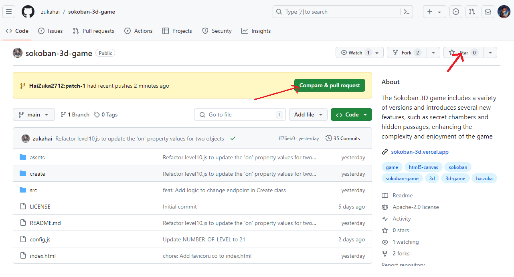
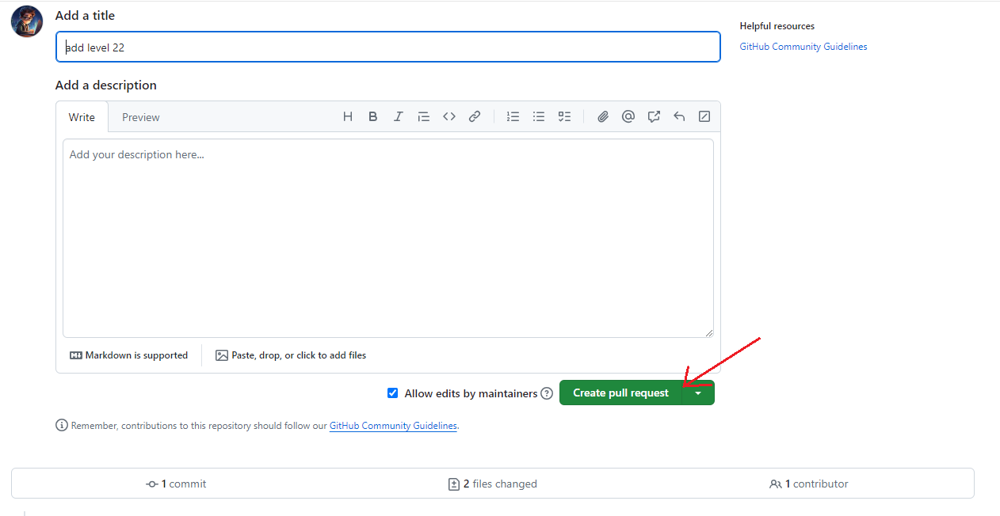

# SOKOBAN 3D GAME

## Description

https://github.com/zukahai/sokoban-3d/assets/85035951/bc061f7f-dc4e-4c92-b09d-c8b09f2b0672

Đây là trò chơi đẩy thùng, nhiệm vụ của bạn là di chuyển khối lập phương màu đen để tìm tới vị trí của quả cầu,
để di chuyển khối lập phương bạn chỉ cần nhấn vào các phím mũi tên trên bàn phím. Trò chơi có nhiều biến thể các khối lập phương công như có một số cơ quan mật thất, cầu thang, cửa, chìa khóa, v.v. Bạn cần phải tìm ra cách để vượt qua các chướng ngại vật này để tìm ra vị trí của quả cầu.

## Installation

Chơi trực tiếp tại [đây](https://sokoban-3d.vercel.app/)

## Contributor

### Tạo 1 màn chơi mới của riêng bạn

Try cập: https://sokoban-3d.vercel.app/create/

Mục Lục:

1. [Xem thử màn chơi của bạn](#1-xem-thử-màn-chơi-của-bạn)
2. [Thay đổi độ cao các khối](#2-thay-đổi-độ-cao-các-khối)
3. [Thêm hàng, cột](#3-thêm-hàng-cột)
4. [Thêm điểm xuất phát](#4-thêm-điểm-xuất-phát)
5. [Thay đổi điểm kết thúc](#5-thay-đổi-điểm-kết-thúc)
6. [Thêm các khối lập phương thường](#6-thêm-các-khối-lập-phương-thường)
7. [Thêm các khối lập phương có thể leo](#7-thêm-các-khối-lập-phương-có-thể-leo)
8. [Thêm công tắc thường](#8-thêm-công-tắc-thường)
9. [Thêm công tắc giữ](#9-thêm-công-tắc-giữ)

#### 1. Xem thử màn chơi của bạn
Bấm `Enter` để xem thử màn chơi của bạn:

Ví dụ như với hình dưới đây:

Thì sau khi bấm `Enter` sẽ hiện ra màn chơi như sau:

#### 2. Thay đổi độ cao các khối

Thay đổi độ cao các khối bằng các bấm vào các ô, các giá trị sẽ thay đổi từ 0 đến 9, chính là độ cao của các khối.

#### 3. Thêm hàng, cột

- Bấm ↑ để thêm hàng phía trên
- Bấm ↓ để thêm hàng phía dưới
- Bấm ← để thêm cột bên trái
- Bấm → để thêm cột bên phải.

#### 4. Thêm điểm xuất phát.

Bấm phím `S` rồi chọn ô mà bạn muốn làm điểm xuất phát.

#### 5. Thay đổi điểm kết thúc.

Bấm phím `K` rồi chọn ô mà bạn muốn làm điểm kết thúc.

#### 6. Thêm các khối lập phương thường.

Bấm phím `P` rồi chọn ô mà bạn muốn làm khối lập phương.

#### 7. Thêm các khối lập phương có thể leo

Bấm phím `Q` rồi chọn ô mà bạn muốn làm khối lập phương có thể leo.

#### 8. Thêm công tắc thường

Bấm phím `B` để hiện như hình bên dưới

Click và ô màu xanh để thay đổi độ sâu khi mà công tắc kích hoạt. Số 1 có nghĩa là khi bấm vào công tắc thì ô chỉ định sẽ giảm 1 độ sâu. Số -1 có nghĩa là khi bấm vào công tắc thì ô chỉ định sẽ giảm 1 độ sâu.

Chọn ô đặt công tắc, sau đó tiếp tục chọn ô mà công tắc sẽ kích hoạt

#### 9. Thêm công tắc giữ

Bấm phím `M` rồi làm tương tự như công tắc thường.

## Cách thêm màn chơi của bạn vào trò chơi

Có thể nhắn tin trực tiếp qua facebook của mình: [Phan Đức Hải](https://www.facebook.com/chiatayde/) và gửi file `data.txt` cho mình.

Nếu bạn có tài khoản github, bạn có thể tự thêm màn chơi của bạn vào trò chơi bằng cách thực hiện các bước sau:

Tại https://sokoban-3d.vercel.app/create/

Bấm `H` để tại về 1 file có tên `data.txt`. Copy nội dung file này và làm tiếp theo hướng dẫn.

Truy cập: https://github.dev/zukahai/sokoban-3d-game

Chờ đợt trang web load xong, sẽ hiện ra như hình dưới đây:

Chọn `config.js`, bên trong đang lưu số lượng màn chơi hiện tại, bạn cần tăng nó lên 1, Ví dụ hiện tại đang có 21 màn chơi thì bạn cần sửa thành 22.

Tiếp tục chọn `assets` đợi nó load một lát xong chọn tiếp phần `levels`, cửa số lúc này sẽ hiện ra như hình dưới đây:

Bấm vào icon như hình dưới để tạo 1 file mới với tên là `levelX.json` trong đó `X` là số thứ tự màn chơi của bạn. Ví dụ bạn muốn tạo màn chơi thứ 22 thì bạn cần tạo file `level22.json`.
*Lưu ý: Hệ thống github.dev load liên tục nên đôi khi sẽ không nhận được tín hiệu tạo file của bạn, cần kiên nhẫn thực hiện thao tác này nhiều lần nếu không thấy hệ thông yêu cầu nhập tên file*

Sau đó dán nội dung file `data.txt` vào file `levelX.json` vừa tạo, Nhớ sửa lại phần `indexLevel` thành `X` trong file `levelX.json`. Ví dụ bạn đang tạo màn chơi thứ 22 thì bạn cần sửa thành `var indexLevel = 22;`.

- Chuyển qua tag source control, bằng cách chọn biểu tượng 1 như hình dưới
- Viết 1 đoạn thông điệp cho mình biết bạn muốn làm gì, ví dụ `add level 22`
- Bấm nút `Commit and push`

Nếu có thông báo hiện ra, chọn `fork repository` để tạo 1 bản sao của trò chơi trên github của bạn.

Nếu giao diện tiếp theo như vậy, bạn chỉ việc chọn vào `patch-1` bấm phím `Enter` để tạo Pull Request.

Cuối cùng là bước tạo Pull Request: Truy cập: https://github.com/zukahai/sokoban-3d-game

Chọn `Compare & pull request`

Cuối cùng chọn `Create pull request` và chờ đợi phản hồi từ mình.

#### Nếu bạn bị mắc lỗi ở đâu đấy hoặc cảm chưa làm được có thể lên hệ qua facebook của mình: [Phan Đức Hải](https://www.facebook.com/chiatayde/)

