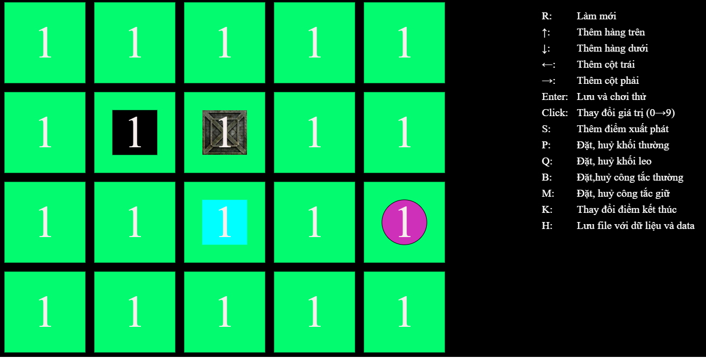
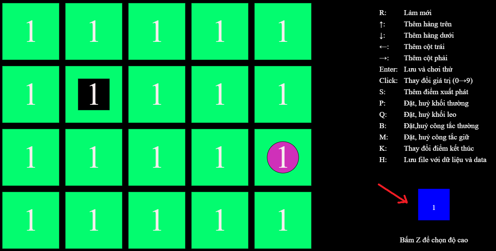

# SOKOBAN 3D GAME

## Description

https://github.com/zukahai/sokoban-3d/assets/85035951/bc061f7f-dc4e-4c92-b09d-c8b09f2b0672

Đây là trò chơi đẩy thùng, nhiệm vụ của bạn là di chuyển khối lập phương màu đen để tìm tới vị trí của quả cầu,
để di chuyển khối lập phương bạn chỉ cần nhấn vào các phím mũi tên trên bàn phím. Trò chơi có nhiều biến thể các khối lập phương công như có một số cơ quan mật thất, cầu thang, cửa, chìa khóa, v.v. Bạn cần phải tìm ra cách để vượt qua các chướng ngại vật này để tìm ra vị trí của quả cầu.

## Installation

Chơi trực tiếp tại [đây](https://sokoban-3d.vercel.app/)

## Contributor

### Tạo 1 màn chơi mới của riêng bạn

Try cập: https://sokoban-3d.vercel.app/create/

Mục Lục:

1. [Xem thử màn chơi của bạn](#1-xem-thử-màn-chơi-của-bạn)
2. [Thay đổi độ cao các khối](#2-thay-đổi-độ-cao-các-khối)
3. [Thêm hàng, cột](#3-thêm-hàng-cột)
4. [Thêm điểm xuất phát](#4-thêm-điểm-xuất-phát)
5. [Thay đổi điểm kết thúc](#5-thay-đổi-điểm-kết-thúc)
6. [Thêm các khối lập phương thường](#6-thêm-các-khối-lập-phương-thường)
7. [Thêm các khối lập phương có thể leo](#7-thêm-các-khối-lập-phương-có-thể-leo)
8. [Thêm công tắc thường](#8-thêm-công-tắc-thường)
9. [Thêm công tắc giữ](#9-thêm-công-tắc-giữ)

#### 1. Xem thử màn chơi của bạn
Bấm `Enter` để xem thử màn chơi của bạn:

Ví dụ như với hình dưới đây:

Thì sau khi bấm `Enter` sẽ hiện ra màn chơi như sau:

#### 2. Thay đổi độ cao các khối

Thay đổi độ cao các khối bằng các bấm vào các ô, các giá trị sẽ thay đổi từ 0 đến 9, chính là độ cao của các khối.

#### 3. Thêm hàng, cột

- Bấm ↑ để thêm hàng phía trên
- Bấm ↓ để thêm hàng phía dưới
- Bấm ← để thêm cột bên trái
- Bấm → để thêm cột bên phải.

#### 4. Thêm điểm xuất phát.

Bấm phím `S` rồi chọn ô mà bạn muốn làm điểm xuất phát.

#### 5. Thay đổi điểm kết thúc.

Bấm phím `K` rồi chọn ô mà bạn muốn làm điểm kết thúc.

#### 6. Thêm các khối lập phương thường.

Bấm phím `P` rồi chọn ô mà bạn muốn làm khối lập phương.

#### 7. Thêm các khối lập phương có thể leo

Bấm phím `Q` rồi chọn ô mà bạn muốn làm khối lập phương có thể leo.

#### 8. Thêm công tắc thường

Bấm phím `B` để hiện như hình bên dưới

Click và ô màu xanh để thay đổi độ sâu khi mà công tắc kích hoạt. Số 1 có nghĩa là khi bấm vào công tắc thì ô chỉ định sẽ giảm 1 độ sâu. Số -1 có nghĩa là khi bấm vào công tắc thì ô chỉ định sẽ giảm 1 độ sâu.

Chọn ô đặt công tắc, sau đó tiếp tục chọn ô mà công tắc sẽ kích hoạt

#### 9. Thêm công tắc giữ

Bấm phím `M` rồi làm tương tự như công tắc thường.
